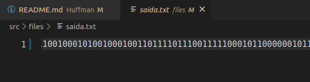

# Código de Huffman
<h2 align="center"> Marinêz Werneck Magalhães </h2>

 

## Introdução Teórica:

A codificação de Huffman é um método de compactação que usa as probabilidades de ocorrência dos símbolos no conjunto de dados a ser compactado para determinar códigos de tamanho variável para cada símbolo.
  
### O algoritmo de Huffman
  

- Assuma que cada caracter em um texto está associado a um peso, que é definido pelo número de vezes que o caracter aparece em um arquivo. Na string “bom esse bombom”, os caracteres “b”, “o” e “m” têm peso 3, enquando os caracteres “e”, “s” e espaço têm peso 2. Para usar o
algoritmo de Huffman, é necessário calcular esses pesos. O algoritmo de Huffman assume que uma árvore será construída a partir de um grupo de
árvores. Inicialmente essas árvores têm um único nó com um caracter e o peso deste caracter. À cada iteração do algoritmo, duas árvores são juntadas criando uma nova árvore. Isso faz com que o número de árvores diminua a cada passo.
  
### Algoritmo:
  
 

1. Comece com uma lista de árvores. Inicialmente, todas as árvores são compostas de um nó
apenas, com o peso da árvore igual ao peso do caracter do nó. Caracteres que ocorrerem
mais frequentemente têm o maior peso. Caracteres que ocorrerem menos frequentemente
têm o menor peso. Ordene a lista de árvores de forma crescente, fazendo com que o nó
raiz da primeira árvore seja o caracter de menor peso e o nó raiz da última árvore seja o
caracter de maior peso.
 

2. Repita os passos a seguir até que sobre apenas uma única árvore:
Pegue as duas primeiras árvores da lista e as chame de T1 e T2. Crie uma nova
árvore Tr cuja raiz tenha o peso igual à soma dos pesos de T1 e T2 e cuja
subárvore esquerda seja T1 e subárvore direita seja T2.
Exclua T1 e T2 da lista (mantendo T1 e T2 na memória) e inclua Tr na lista,de
maneira que a lista seja mantida ordenada.
 

3. A árvore final será a árvore ótima de codificação

## Descrevendo o problema:

Elabore uma árvore binária que utilize o código de Huffman para comprimir arquivos. Para tanto, (1) contabilizar a recorrência de cada palavra(RP) no arquivo; (2) normalizar a contabilização entre 0 e 1 utilizando a fórmula: (RP/(quantidade de palavras)); (3) montar a árvore com as regras apresentadas por Huffman; (4) troque as palavras pela codificação binária (utilizar booleano para representar 0 e 1); (5) salve o arquivo em formato binário e observe qual foi o ganho de espaço obtido.

Elabore um Readme.mb explicando toda lógica utilizada na implementação, bem como, exemplos para representar funcionalidades da aplicação. Feito isso, demonstre um desses exemplos em execução para detalhar para o leitor o que ele deve esperar como saída. Além disso, detalhe tudo que for importante no código e mostre como deve ser compilado.

## Funcionamento do código:

Os códigos foram criados com base no Código de Árvore fornecido pelo professor Michel em seu Git.

### Arquivo "util.hpp"
- Faz a Tokenização - retorna um vetor de string;

### Arquivo "read.hpp"
- Faz a leitura da entrada "huff.txt" e apresenta a saída convetida em formato binário "saida.txt";

### Arquivo "tree.cpp"
-> (Tree *CreateTree() ) 
- Cria a árvore;

-> (bool TVazia(Tree **t))

- Verifica se está vazia;

-> (insertTree)
- Faz a inserção na Árvore;

-> (void operHuffman(vector <Tree *> *f_init, vector <Tree *> *f_reduz, Tree *raiz))
- Faz a operação de Huffman - compara enquanto for maior que 2, armazena raiz em f_reduz;

-> (void insertTreeHuff(vector <Tree *> *f_init, Tree **raiz_final) )
- Faz a inserção na àrvore de Huffman, se for maior adiciona na esquerda, menor, direita, utilizando recursão;

-> (void decodeBinary(Tree *raiz_final))
- Faz decodificação do arquivo,usando os parâmetros de esquerda e direita novamente, e apresenta em arquivo "saida.txt";

-> (void codifica(Tree *t, map<string, string> *mapa, string s, string aux))
- Faz a codificação da entrada de volta e apresenta na tela.

## Resultados e Conclusão:

Para a entrada utilizada como modelo obteve-se um pequeno ganho na compactação do arquivo ".txt" após a aplicação da implementação de Huffman

Após a execução do código o resultado foi impresso em "saida.txt", no formato binário

  </img>

O pequeno ganho na compactação do arquivo ".txt" após a aplicação da implementação de Huffman é apresentado abaixo.

  </img>

O terminal após execução do Código apresenta a Entrada novamente ordenada.

  </img>

O código de Huffman requer ordenação, o algoritmo apresentado faz ordenação. No algoritimo, quando é feita inserção na arvore da esquerda e direita, não ordena o vetor inicial, isso talvez gere arquivo maiores. O que não aconteceu no arquivo de teste.

## Compilação:

### Compilação padrão

| Comando | Função |
|---------| --------|
| `make clean` | Apaga a última compilação realizada contida na pasta build |
| `make` | Executa a compilação do programa utilizando o g++, e o resultado vai para a pasta build |
| `make run` | Executa o programa da pasta build após a realização da compilação |

### Compilação alternativa

| Comando | Função |
|---------| --------|
| `make r` | Limpa tudo, compila e executa |

